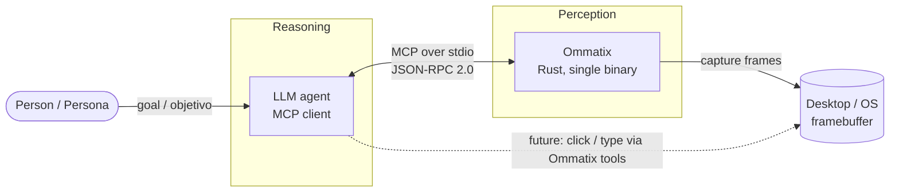

# System context / Contexto del sistema

*Ommatix sits between the agent (reasoning) and the desktop (pixels).*
*Ommatix se ubica entre el agente (razonamiento) y el escritorio (píxeles).*

```mermaid
flowchart LR
    user([Person / Persona]) -->|goal / objetivo| agent
    subgraph Reasoning
      agent[LLM agent<br/>MCP client]
    end
    subgraph Perception
      ommatix[Ommatix<br/>Rust, single binary]
    end
    agent <-->|MCP over stdio<br/>JSON-RPC 2.0| ommatix
    ommatix -->|capture frames| os[(Desktop / OS<br/>framebuffer)]
    agent -. future: click / type via Ommatix tools .-> os
```
